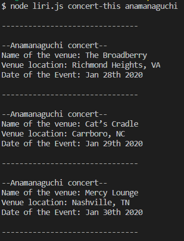
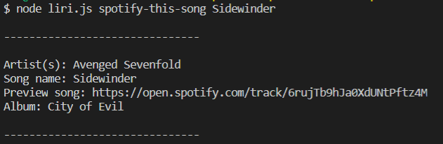
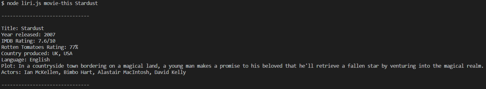
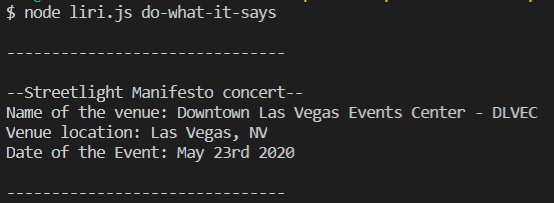

# Liri Bot ~

Liri bot will will take any of the commands below and give the user the following information:

1. `node liri concert-this <band here>` -
    * Band name
    * Name of the venue
    * Venue location
    * Date of the Event
2. `node liri spotify-this-song <song here>` -
    * Artist(s)
    * Song name
    * Preview song link
    * Album
3. `node liri movie-this <movie here>` - 
    * Title
    * Year released
    * IMDB Rating
    * Rotten Tomatoes Rating
    * Country produced
    * Language
    * Plot
    * Actors
4. `node liri do-what-it-says` - 
    * It will run some pre-selected calls that I have specified in the random.txt file.

## Call Examples ~

1. `node liri concert-this <band here>` -

--Blink-182 concert--
 Name of the venue: The Forum
 Venue location: Los Angeles, CA
 Date of the Event: Jan 18th 2020

--Blink-182 concert--
 Name of the venue: Ohio State Reformatory
 Venue location: Mansfield, OH
 Date of the Event: Jul 10th 2020

2. `node liri spotify-this-song <song here>` -

Artist(s): Soundgarden
 Song name: Spoonman
 Preview song: https://open.spotify.com/track/1jMaB19DiVR8OihLSuYFOt
 Album: Superunknown (20th Anniversary)

3. `node liri movie-this <movie here>` - 

Title: Stardust
 Year released: 2007
 IMDB Rating: 7.6/10
 Rotten Tomatoes Rating: 77%
 Country produced: UK, USA
 Language: English
 Plot: In a countryside town bordering on a magical land, a young man makes a promise to his beloved that 
 he'll retrieve a fallen star by venturing into the magical realm.
 Actors: Ian McKellen, Bimbo Hart, Alastair MacIntosh, David Kelly

4. `node liri do-what-it-says` - 

Artist(s): Noriko Mitose
 Song name: Radical Dreamers -Le Tresor Interdit-
 Preview song: https://open.spotify.com/track/4qsyVDZdjslzghC3NfKQuO
 Album: Chrono Cross Original Soundtrack

5. `node liri` (Missing argument case) - 

Liri does not recognize your command. Please use one of the following:
 
 concert-this <artist/band name here>
 spotify-this-song <song name here>
 movie-this <movie name here>
 do-what-it-says

6. `node liri <command here> askdjfhlashdflksdhjf` (Error case) - 

There was an error finding that movie! Please try again!

# Example Pictures ~

* #### concert-this

* #### spotify-this-song

* #### movie-this

* #### do-what-it-says

